# Engineering_4_Notebook

&nbsp;

## Table of Contents
* [Raspberry_Pi_Assignment_Template](#raspberry_pi_assignment_template)
* [LED Blink](#LED_blink)
* [Launchpad Countdown](#Launchpad_countdown)
* [Launchpad countdown with LEDs](#Launchpad_countdown_with_LEDs)
* [Launchpad countdown with Button](Launchpad_countdown_with_Button)
* [FEA Part 3](FEA_part_3)
* [FEA Part 4](FEA_part_4)
* [Onshape_Assignment_Template](#onshape_assignment_template)

&nbsp;

## Raspberry_Pi_Assignment_Template

### Assignment Description

Write your assignment description here. What is the purpose of this assignment? It should be at least a few sentences.

### Evidence 

Pictures / Gifs of your work should go here. You need to communicate what your thing does. 

### Wiring

This may not be applicable to all assignments. Anything where you wire something up, include the wiring diagram here. The diagram should be clear enough that I can recreate the wiring from scratch. 

### Code
Give me a link to your code. [Something like this](https://github.com/millerm22/Engineering_4_Notebook/blob/main/Raspberry_Pi/hello_world.py). Don't make me hunt through your folders, give me a nice link to click to take me there! Remember to **COMMENT YOUR CODE** if you want full credit. 

### Reflection

What went wrong / was challenging, how'd you figure it out, and what did you learn from that experience? Your goal for the reflection is to pass on knowledge that will make this assignment better or easier for the next person. Think about your audience for this one, which may be "future you" (when you realize you need some of this code in three months), me, or your college admission committee!

&nbsp;

## LED_blink

### Assignment Description

For this assignment I was asked to make the rasberry pi's onboard LED blink.

### Evidence 

Pictures / Gifs of your work should go here. You need to communicate what your thing does. 

### Code
[code](https://github.com/matthewbowling123/Engineering_4_Notebook/blob/main/raspberry-pi/LED_blink.py)

### Reflection

This assignment may not have been the most difficult but it helped me relearn how CPython code works. It recaped how an LED is wired and coded whcih was helpful in jogging my memory. Im glad I was able to do this and will chalenge more difficult assignments next.

## Launchpad_countdown

### Assignment Description

For this assignment I was asked to make the Pico print a countdown from 10 and then Print Liftoff after the countdown finished.

### Evidence 

### Code
[Code](https://github.com/matthewbowling123/Engineering_4_Notebook/blob/main/raspberry-pi/Pico_Liftoff.py)

### Reflection

This assignment brought back several commands that I needed to remember for this class. for example I learned about the X function being set and how to make the Serial Monitor print a countdown. I did not require help but I did take slightly longer on this assignment which means it was somewhat mor difficult.

## Launchpad_countdown_with_LEDs

### description
for this assignment I was asked to expand on the previous countdown assignment by having a red LED blink whenever the value of the countdown decreased. I was also asked to have a green LED turn on when the countdown finished.

### Evidence

### Wiring
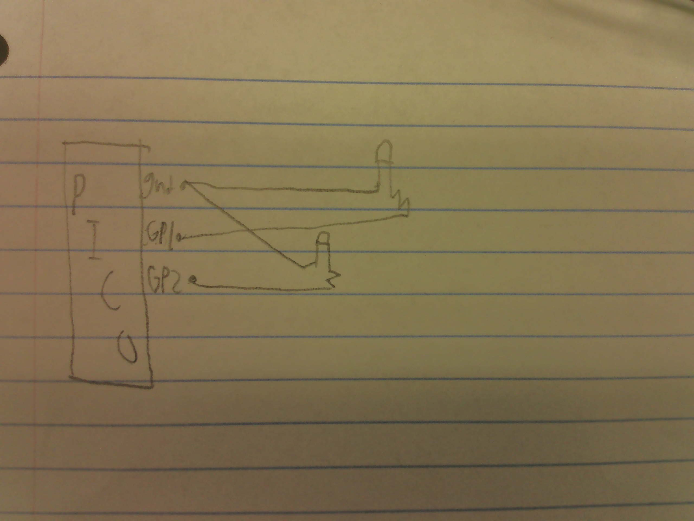

### Code

[Code](https://github.com/matthewbowling123/Engineering_4_Notebook/blob/main/raspberry-pi/Pico_Liftoff.py)

### Reflection
This was essentially the previous assignment but with an added LED. I used what I learned about LEDs last year and added that knowledge to this assignment. Overall I learned a lot on this assignment.

## Launchpad_countdown_with_Button
### Description
For this assignment I was asked to add a button to the previous assignment which would start the countdown.
### Evidence

### Wiring
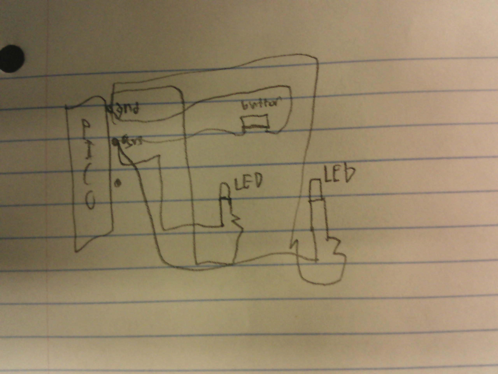
### Code
[Code](https://github.com/matthewbowling123/Engineering_4_Notebook/blob/main/raspberry-pi/Pico_Liftoff.py)
## Launchpad countdown with Button and Sevo

### Description
For this next part of the assignment I was asked to add a Servo tnat would rotate after the countdown. then to spice it up I was asked to add an abort function which would abort the countdown when the button was pressed.

### Evidence

### Wiring
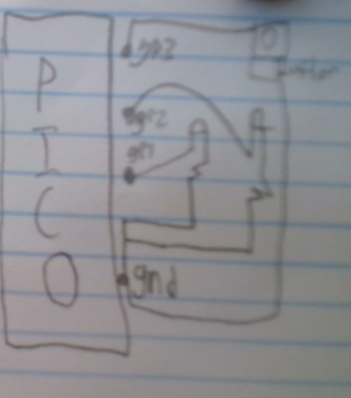

### Code
[Code](https://github.com/matthewbowling123/Engineering_4_Notebook/blob/main/raspberry-pi/Pico_Liftoff.py)

### Reflection
This assignment added a Servo. The Servo was used in previous years but this assignment helped remind me how to wire and code it. I learned a lot about the Servo commands as well.

## Crash Avoidence Pt 1

### Description
for this assignment I was supposed to use an accelerometer to print the values of acceleration.

### Evidence

### Wiring
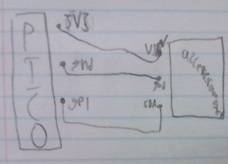

### Reflection
This assignment intoroduced the accelerometer. I used this component 2 years ago but it was with a differant coding program so I was really relearning this from scratch. I used the help of other students around me to learn about this and I am glad I could learn more about this important hardware.

## Crash Avoidence Pt 2

### Description
For this assignment I was meant to make an LED turn on whenever the ship was rotated 90 degrees.

### Code
[Code](https://github.com/matthewbowling123/Engineering_4_Notebook/blob/main/raspberry-pi/CrashAvoidence)

### Wiring
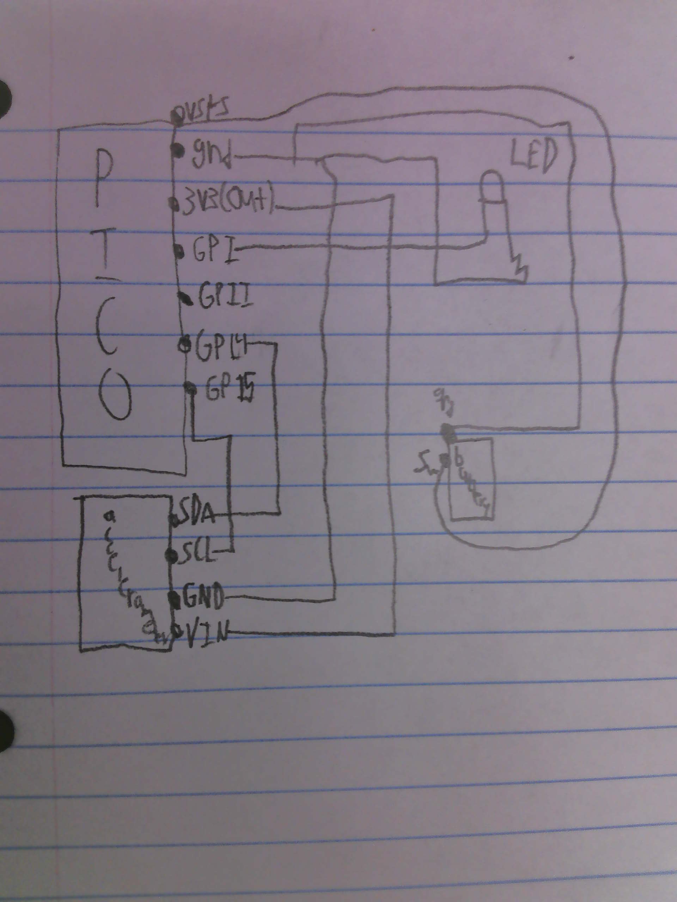

### Reflection
This assignment was mostly pretty simple but the battery took a little bit to figure out. I learned how to charge the Battery and how to wire and code it which will be very helpful later this year. This assignment was great because i learned something.

## Crash Avoidence 3

### Description
for this assignment I was asked to add an OLED screen to the previous circuit that would print the gyro values while the circuit runs.

### Evidence
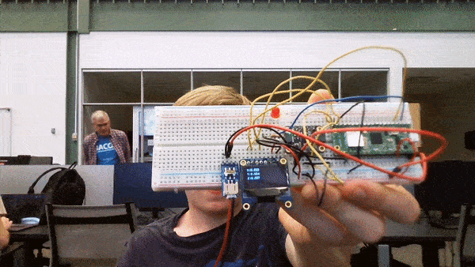

### Code
[code](https://github.com/matthewbowling123/Engineering_4_Notebook/blob/main/raspberry-pi/CrashAvoidenceOLED)

### Wiring
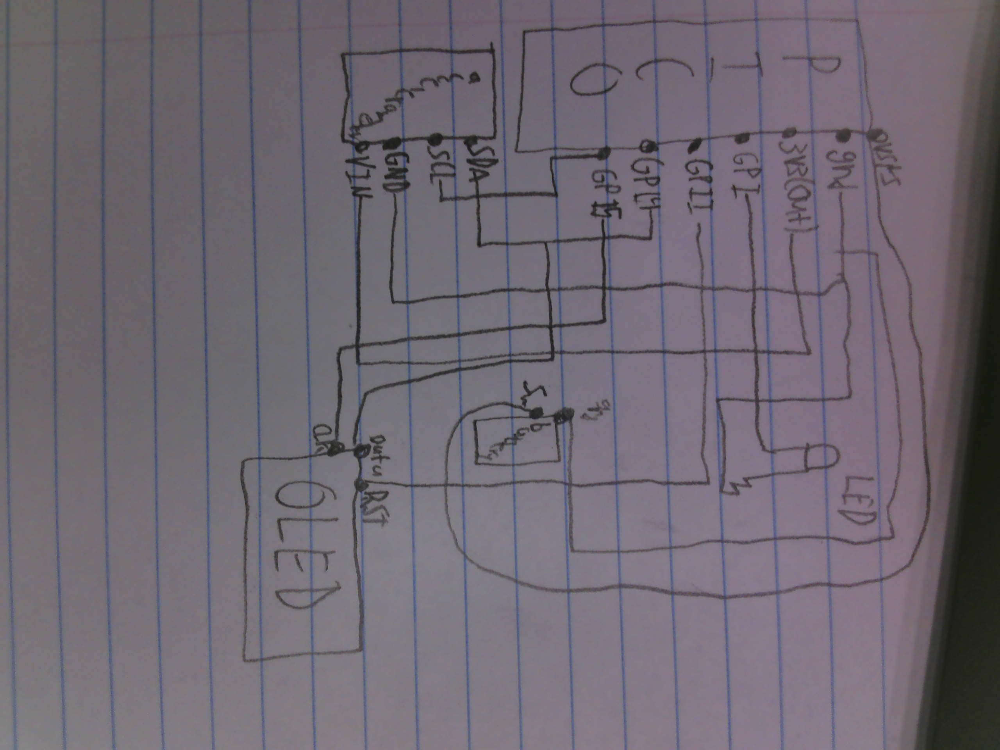

### Reflection 
This assignment was the first one this year that was acctually challenging. It was difficult because I had never used an OLED before. I learned about the OLEDs wiring and Code as well as learned about f strings which will all be very helpful in the future. Im very glad I did this assignment even though it was very hard.

## FEA_part_3

### Description
For this part of the assignment we were meant to simulate our beam using the onshape simulation and predict things like deflection and breaking points.

### Evidence
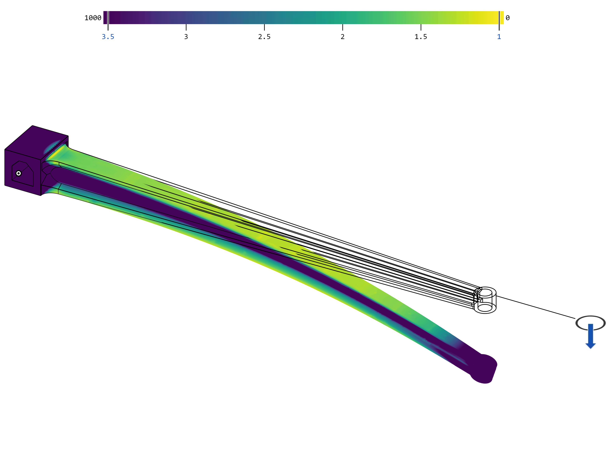

### Reflection
This assignment was the first time we had ever used the Onshape simulation. We had to research how it works through Onshapes very helpful tutorials. Through the simulation we lerned that the point with the most stress was on the back of the beam and used this information to further support that area. It also helped us learn how to distribute the weight. The Simulation works by applying a force to the object. It then color codes the entire object and gives you the stress factor with yellow being the most stress and blue being the least. These will be very helpful in future projects.

## FEA_part_4

### Description
After simulating the beam we had to improve on the design in order to make its deflection better.

### Evidence
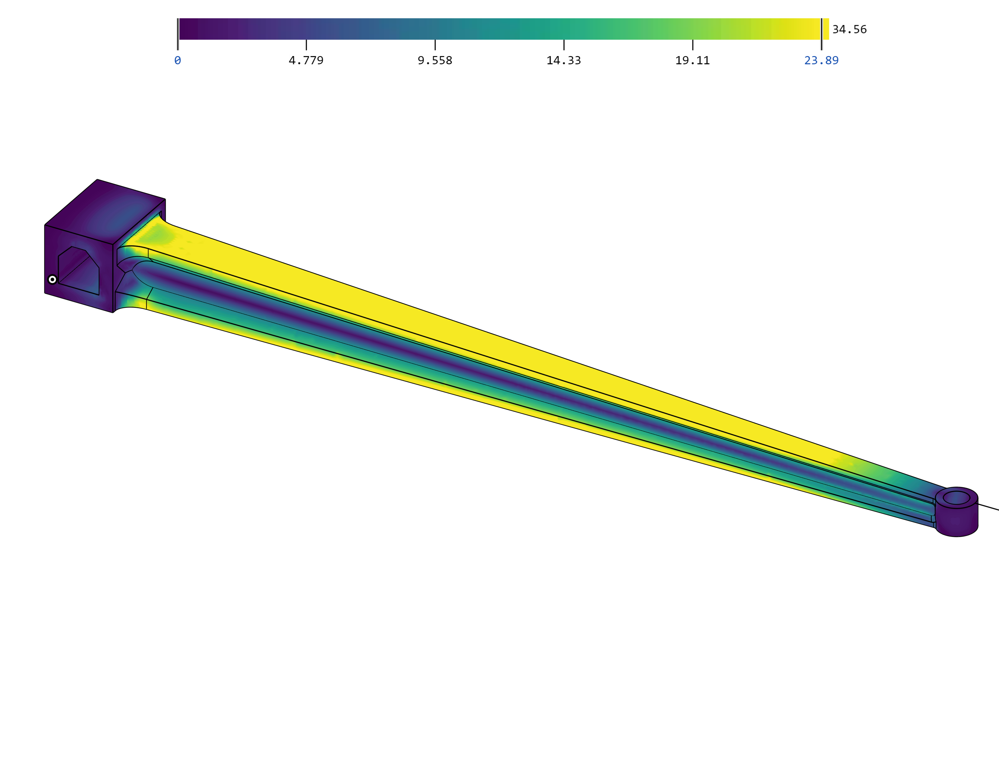
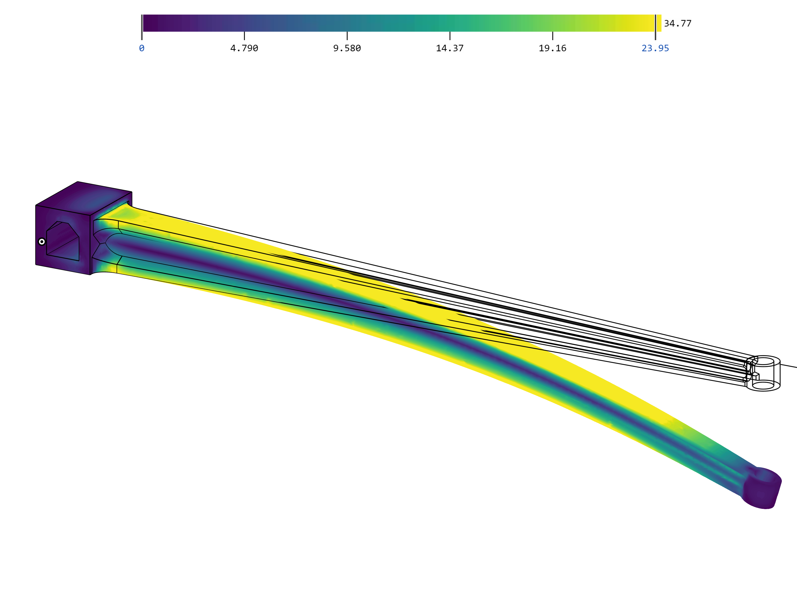

### Reflection
After our previous beam broke we began working on a new one. We took the old one and changed the distribution of the weight by changing the length and and angles along the first Loft that created the beam. We also changed the hollow part of the beam to instead be two holes going through the Loft which added more strength in the middle and provided less stress. In order to take the stress off the back of the beam we added fillets on the back that supported extra weight. This ultimately distributed the weight more evenly throughtout the beam which reduced the total stress in any area. We also figured out that the simulation was bonded wrong because it had bonded with all faces instead of specific mates. After fixing this problem the simulation began running more smoothly and provided a more accurate anlaysis.

## Beam Design
### Description
For this assignment we were challenged to create a beam that could support the most amount of weight that we could. It also included several constraints we needed to follow. For example it needed to be 180 mm long and could not use angles greater than 45 degrees.
### Part Link
[Link](https://cvilleschools.onshape.com/documents/612d3b9286e5a0bfa339152e/w/fc81e668b00e0ee0c54c7765/e/e5900d19b5ba4f1918d7debd)
### Part Image
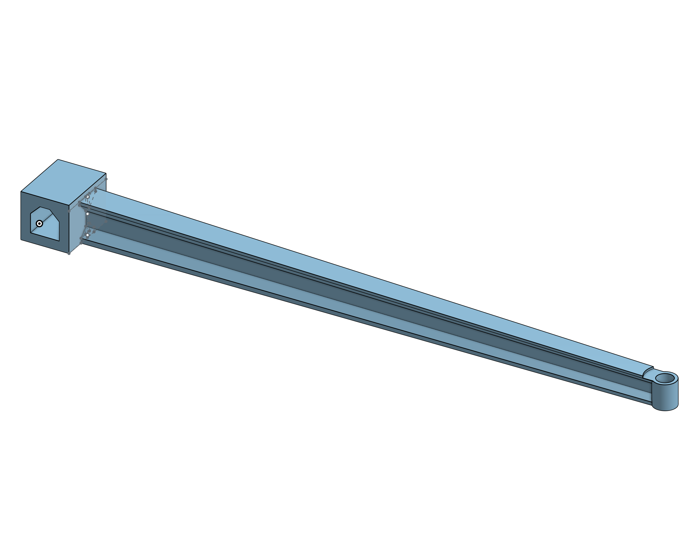
### Reflection
For this assignment we began by researching beam theory which taught us about point loads and cantilever beams. Using this knowledge we decided to make an I beam with evenly distributed weight. Because of the rule about angles we decided to use Chamfers on the edges which made the angles the right amount of degrees. We also used a loft so that the weight could be distributed better. We owe a lot of thanks to [this website](https://engineering.stackexchange.com/questions/50258/whats-the-best-shape-solid-of-revolution-for-a-cantilever-beam-to-carry-a-poi) for helping us learn about cantilever beams and showing us that the I beam is the best option.
## Onshape_Assignment_Template

### Assignment Description

Write your assignment description here. What is the purpose of this assignment? It should be at least a few sentences.

### Part Link 

[Create a link to your Onshape document](https://cvilleschools.onshape.com/documents/003e413cee57f7ccccaa15c2/w/ea71050bb283bf3bf088c96c/e/c85ae532263d3b551e1795d0?renderMode=0&uiState=62d9b9d7883c4f335ec42021). Don't forget to turn on link sharing in your Onshape document so that others can see it. 

### Part Image

Take a nice screenshot of your Onshape document. 

### Reflection

What went wrong / was challenging, how'd you figure it out, and what did you learn from that experience? Your goal for the reflection is to pass on knowledge that will make this assignment better or easier for the next person. Think about your audience for this one, which may be "future you" (when you realize you need some of this code in three months), me, or your college admission committee!

&nbsp;

## Media Test

Your readme will have various images and gifs on it. Upload a test image and test gif to make sure you've got the process figured out. Pick whatever image and gif you want!

### Test Link
[readme](https://github.com/matthewbowling123/Engineering_4_Notebook/blob/main/README.md)
### Test Image
  
### Test GIF

