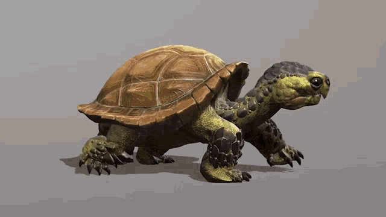

# Engineering_4_Notebook

&nbsp;

## Table of Contents
* [Raspberry_Pi_Assignment_Template](#raspberry_pi_assignment_template)
* [LED Blink](#LED_blink)
* [Onshape_Assignment_Template](#onshape_assignment_template)

&nbsp;

## Raspberry_Pi_Assignment_Template

### Assignment Description

Write your assignment description here. What is the purpose of this assignment? It should be at least a few sentences.

### Evidence 

Pictures / Gifs of your work should go here. You need to communicate what your thing does. 

### Wiring

This may not be applicable to all assignments. Anything where you wire something up, include the wiring diagram here. The diagram should be clear enough that I can recreate the wiring from scratch. 

### Code
Give me a link to your code. [Something like this](https://github.com/millerm22/Engineering_4_Notebook/blob/main/Raspberry_Pi/hello_world.py). Don't make me hunt through your folders, give me a nice link to click to take me there! Remember to **COMMENT YOUR CODE** if you want full credit. 

### Reflection

What went wrong / was challenging, how'd you figure it out, and what did you learn from that experience? Your goal for the reflection is to pass on knowledge that will make this assignment better or easier for the next person. Think about your audience for this one, which may be "future you" (when you realize you need some of this code in three months), me, or your college admission committee!

&nbsp;

## LED_blink

### Assignment Description

For this assignment I was asked to make the rasberry pi's onboard LED blink.

### Evidence 

Pictures / Gifs of your work should go here. You need to communicate what your thing does. 

### Code
[code](https://github.com/matthewbowling123/Engineering_4_Notebook/blob/main/raspberry-pi/LED_blink.py)

### Reflection

This assignment was easy but it really only existed to get us used to the new Pico and refresh our knowledge on CPython. This was a very fun assignment. It was a real learning expierience

## Launchpad countdown

### Assignment Description

For this assignment I was asked to make the Pico print a countdown from 10 and then Print Liftoff after the countdown finished.

### Evidence 

### Code
[Code](https://github.com/matthewbowling123/Engineering_4_Notebook/blob/main/raspberry-pi/Pico_Liftoff.py)

### Reflection

This assignment really helped me remember how CPython works. It was a litlle challenging at first but after a bit of tinkering I figured it out.

## Launchpad countdown with LEDs

### description
for this assignment I was asked to expand on the previous countdown assignment by having a red LED blink whenever the value of the countdown decreased. I was also asked to have a green LED turn on when the countdown finished.

### Evidence

### Code

[Code](https://github.com/matthewbowling123/Engineering_4_Notebook/blob/main/raspberry-pi/Pico_Liftoff.py)

### Launchpad countdown with Button and Servo

## Description
For this next part of the assignment I was asked to add a button that started the countdown and a Servo which rotates when the countdown ends. then to spice it up I was asked to add an abort function which would abort the countdown when the button was pressed.

## Evidence

### Code
[Code](https://github.com/matthewbowling123/Engineering_4_Notebook/blob/main/raspberry-pi/Pico_Liftoff.py)

## Crash Avoidence Pt 1

### Description
for this assignment I was supposed to use an accelerometer to print the values of acceleration.
## Evidence

## Crash Avoidence Pt 2

### Description
For this assignment I was meant to make an LED turn on whenever the ship was rotated 90 degrees.
### Code

## Onshape_Assignment_Template

### Assignment Description

Write your assignment description here. What is the purpose of this assignment? It should be at least a few sentences.

### Part Link 

[Create a link to your Onshape document](https://cvilleschools.onshape.com/documents/003e413cee57f7ccccaa15c2/w/ea71050bb283bf3bf088c96c/e/c85ae532263d3b551e1795d0?renderMode=0&uiState=62d9b9d7883c4f335ec42021). Don't forget to turn on link sharing in your Onshape document so that others can see it. 

### Part Image

Take a nice screenshot of your Onshape document. 

### Reflection

What went wrong / was challenging, how'd you figure it out, and what did you learn from that experience? Your goal for the reflection is to pass on knowledge that will make this assignment better or easier for the next person. Think about your audience for this one, which may be "future you" (when you realize you need some of this code in three months), me, or your college admission committee!

&nbsp;

## Media Test

Your readme will have various images and gifs on it. Upload a test image and test gif to make sure you've got the process figured out. Pick whatever image and gif you want!

### Test Link
[readme](https://github.com/matthewbowling123/Engineering_4_Notebook/blob/main/README.md)
### Test Image
  
### Test GIF

